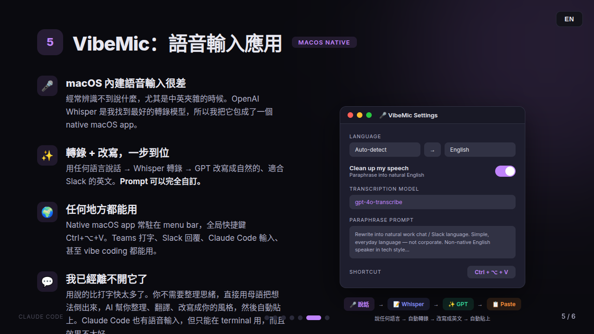

# VibeMic Native (Ubuntu)

[中文版](#中文) | English


System-wide voice-to-text for Ubuntu. Press PgDn to record, press again to transcribe with OpenAI Whisper and instantly paste into any app.

## How it works

1. Press `PgDn` — recording starts, tray icon turns red
2. Press `PgDn` again — audio is sent to OpenAI Whisper
3. Transcribed text is pasted into your currently focused window via clipboard

## Features

- **System-wide** — works in any app, not just VS Code
- **One-key toggle** — PgDn to start/stop recording
- **Instant paste** — clipboard + Ctrl+V, no per-character delay
- **Transcript history** — all transcriptions saved, browse and copy from tray menu
- **Browser-based settings** — configure model, language, temperature, etc. from tray icon
- **System tray icon** — blue (idle), red (recording), orange (transcribing)
- **Multi-language** — Cantonese, English, Mandarin, Japanese, and 97+ other languages
- **Multiple models** — whisper-1, gpt-4o-transcribe, gpt-4o-mini-transcribe

## Requirements

- Ubuntu 20.04+ (or any Linux with X11)
- Python 3.8+
- OpenAI API key with Whisper access
- `sox` for audio recording
- `xdotool` + `xclip` for keyboard simulation and clipboard

## Quick Start

```bash
# 1. Clone
git clone https://github.com/ithiria894/vibemic-native-ubuntu.git
cd vibemic-native-ubuntu

# 2. Run setup (installs system deps + Python packages)
chmod +x setup.sh
./setup.sh

# 3. Open Settings from tray icon and set your API key
python3 vibemic.py
```

## Manual Setup

```bash
# System dependencies
sudo apt install sox libsox-fmt-all xdotool xclip libnotify-bin python3-tk

# Python dependencies
pip3 install --user openai pystray pynput Pillow

# Run
python3 vibemic.py
```

## Configuration

Right-click the tray icon and select **Settings** to configure:

| Setting | Description |
|---------|-------------|
| OpenAI API Key | Your `sk-...` key |
| Model | `whisper-1`, `gpt-4o-transcribe`, `gpt-4o-mini-transcribe` |
| Language | Auto-detect or specify (en, zh, ja, ko, etc.) |
| Prompt | Hint text for Whisper (e.g. expected languages) |
| Temperature | 0 (deterministic) to 1 (creative) |
| Response Format | json, text, srt, verbose_json, vtt |

Settings are saved to `config.json`.

## Tray Menu

- **History** — browse and copy past transcriptions
- **Settings** — open configuration in browser
- **Quit** — stop VibeMic

## How it pastes

Text is copied to clipboard via `xclip` and pasted with `xdotool key ctrl+v` — the same approach as the [VibeMic VS Code extension](https://github.com/ithiria894/VibeMic). This is instant regardless of text length and supports CJK characters and emoji.

## Related

- [VibeMic Native macOS](https://github.com/agents-io/vibemic-native-macos) — macOS version

## License

MIT

---

<a name="中文"></a>
## 中文



全系統語音轉文字 Ubuntu 應用。按 PgDn 錄音，再按一次自動用 OpenAI Whisper 轉錄，並即時貼上到任何應用程式。

### 運作方式

1. 按 `PgDn` — 開始錄音，系統匣圖示變紅
2. 再按 `PgDn` — 音訊傳送至 OpenAI Whisper
3. 轉錄文字透過剪貼簿貼上到目前視窗

### 功能特色

- **全系統** — 適用於任何應用程式
- **一鍵切換** — PgDn 開始/停止錄音
- **即時貼上** — 剪貼簿 + Ctrl+V，支援中日韓文字
- **轉錄記錄** — 所有轉錄自動保存，可從系統匣選單瀏覽和複製
- **瀏覽器設定** — 從系統匣圖示開啟設定頁面
- **多語言支援** — 廣東話、英文、普通話、日文等 97+ 種語言
- **多模型** — whisper-1、gpt-4o-transcribe、gpt-4o-mini-transcribe

### 快速開始

```bash
git clone https://github.com/agents-io/vibemic-native-ubuntu.git
cd vibemic-native-ubuntu
chmod +x setup.sh && ./setup.sh
python3 vibemic.py
```

詳細設定步驟請參考上方英文版。
